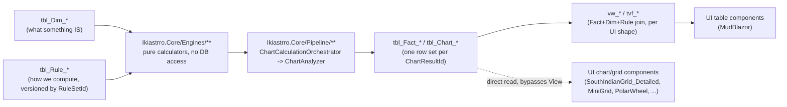

# ikiastrro — data flow: Dim / Rule → Engine → Fact → View → UI

Traces one path end to end — where a number a chart module renders actually came from — and
records the finding + recommendation that came out of tracing it for the Grid reclassification
(chart-catalog.md / project_standards.md §3, not yet changed).

## The five layers

### Dim — `tbl_Dim_*`

Static or slow-changing reference/vocabulary data. Describes what something **is**, independent
of any specific chart. Plural name (STANDARDS §D.1).

Examples: `tbl_Dim_Planets`, `tbl_Dim_SignAttributes` (grandfathered `tbl_SignAttributes`),
`tbl_Dim_Nakshatras`, `tbl_Dim_SubPlanets` (the 11-row upagraha master, `db/27`),
`tbl_Dim_SpecialLagnas` (the 4-row special-lagna master, `db/28`), `tbl_Dim_ChartType`
(`db/02`).

### Rule — `tbl_Rule_*`

Parameterized classical logic/config an **Engine** reads. Singular name, always carries a
`RuleSetId` FK to `tbl_Rule_Sets` (STANDARDS §D.1) — a rule change is a new `RuleSetId`, never a
mutated row, so Fact rows stay interpretable under whichever version produced them.

Examples: `tbl_Rule_AspectOffset`, `tbl_Rule_CombustionOrb`, `tbl_Rule_VargaScheme`,
`tbl_Rule_SubPlanetSunLongitude` / `tbl_Rule_SubPlanetPartRuler` / `tbl_Rule_SubPlanetTime`
(`db/27` — seeded, no engine yet for 9 of the 11 upagrahas), `tbl_Rule_SpecialLagnaTimeRate` /
`tbl_Rule_SpecialLagnaFraction` (`db/28` — seeded, no engine yet for Bhaava/Ghati/Sree).

### Engine — `Ikiastrro.Core/Engines/**`

Pure, stateless C# calculators. Input: `BirthDetails` + Dim + Rule rows (+ Swiss Ephemeris via
`SwissEphemerisProvider`). Output: in-memory records — `DignityResult`, `CombustionResult`,
`AspectResult`, `SpecialPointSeed`, etc. **Never touch the database themselves** — a fact this
project already leans on (domain-contracts.md rule 1: "the UI never runs `Ikiastrro.Core`
calculators").

`Ikiastrro.Core/Pipeline/**` is the layer above raw engines: `ChartCalculationOrchestrator`
dispatches one `BirthDetails` to every registered `IChartCalculator` (D1 + one per varga
scheme), and `ChartAnalyzer` turns each result into the full KeyDetails/HouseLords/
Conjunctions/Aspects row set for that chart type.

### Fact — `tbl_Fact_*`, grandfathered `tbl_Chart_*`

Per-event/per-chart computed results, written once by `Ikiastrro.Data.ChartGenerationService`
(CLI `backfill-charts` / `recompute-keydetails`), never recomputed live by the UI
(domain-contracts.md rule 2). Every row is anchored to `ChartResultId` + `ChartType` +
`RuleSetId` — **this is the "identify the rules to a specific chart" role**: given a Fact row
you always know which Dim/Rule version produced it.

Examples: `tbl_Chart_KeyDetails` (one row per graha/special-point per chart — dignity,
combustion, house numbers, aspecting planets, all already computed), `tbl_Chart_HouseLords`,
`tbl_Chart_Aspects`, `tbl_Chart_Conjunctions` (+ `tbl_Chart_MultiGrahaConjunction*`),
`tbl_Fact_PlanetaryState`, `tbl_Fact_PlanetaryStrength*`, `tbl_Fact_BhavaStrength*`,
`tbl_Fact_Vargottama`.

### View — `vw_*` / `tvf_*`

Read-side joins of Fact(+Dim+Rule), one purpose-built shape per UI table need, catalogued in
[`../database/db_view_catalog.md`](../database/db_view_catalog.md). Exists so a UI table
component reads one pre-joined shape instead of assembling its own joins.

Examples: `vw_ChartPlanetEvidence`, `vw_ChartShadbala`, `vw_ChartBhavaBala`,
`vw_Chart_DashaTimeline`, `tvf_Chart_SadeSatiPeriods`.

## Finding — chart/grid modules do not read through a view today

`db_view_catalog.md`'s own "Chart (non-table) modules" table already says this, it just hadn't
been traced end-to-end before: **`SouthIndianGrid_Detailed`, `MiniGrid`, `D1TemplateGrid`,
`PolarWheel`, `ChartFrame`, `VargottamaStrip`** all load via `WorkspaceData.Load`, which calls
`ChartKeyDetailsRepository` / `ChartHouseLordsRepository` / `ChartAspectsRepository` /
`ChartConjunctionsRepository` — **straight `SELECT` against `tbl_Chart_*`, no `vw_*` in
between** (confirmed in `WorkspaceData.cs`).

So the premise "grid values come from the view table" is **not accurate today** — it's true for
every MudBlazor table component, but chart/grid modules bypass the view layer entirely. Two
ways to resolve this asymmetry:

- **A — leave it.** A grid needs the full per-planet `ChartKeyDetail` row shape anyway; a view
  in between would be a pure passthrough with no projection benefit. Document the asymmetry as
  intentional (grids and tables have genuinely different consumption shapes) and move on.
- **B — introduce `vw_Chart_Grid*` projection views**, one per density tier, so grids get the
  same view-mediated discipline as tables. This has a real payoff for the reclassification
  below: **Micro** and **Macro** need materially different column subsets from **Normal** (a
  summary tier has no business reading `AspectingPlanets` text or `CombustionOrbUsedDegrees`),
  and a SQL view makes "what does this density tier actually need" an explicit, diffable
  contract instead of Razor-side filtering buried in a `@code` block.

**Recommendation: B, but only for the two modules that don't exist yet.** `Grid_Normal_*`
(the rename of today's `SouthIndianGrid_Detailed`) keeps its current direct-Fact-read path —
it's a rename, not a rewrite, and changing its data path at the same time as its name defeats
the golden-snapshot revert story (project_standards.md §3.3). `Grid_Micro_*` and `Grid_Macro_*`
are greenfield either way, so this is the cheapest point to start them on
`vw_Chart_GridMicro` / `vw_Chart_GridMacro` and add the corresponding rows to
`db_view_catalog.md` from day one.

## Reclassification recommendation — see `../ui/components/view-grid.md`

The naming/composition proposal that follows from this trace (Density × Style as two
orthogonal axes, geometry-vs-content-density factoring instead of 9 monolithic components) is
written up in [`../ui/components/view-grid.md`](../ui/components/view-grid.md) — kept there
rather than here because it's a UI-component decision, not a data-flow one; this file only
supplies the "where do the numbers come from" grounding it argues from.
