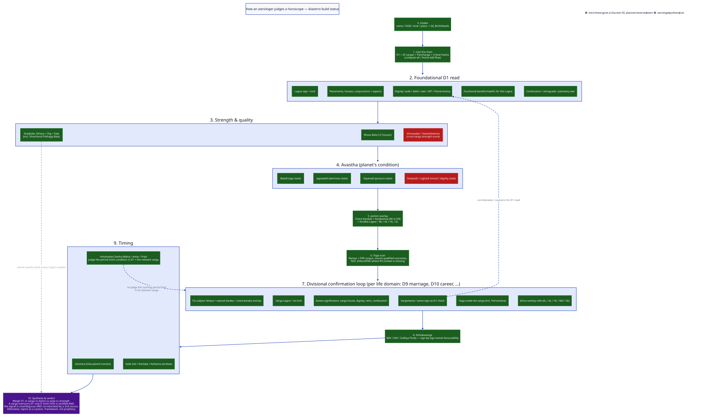

# Reference — Horoscope Judgment Flow (astrologer's user flow)

**Purpose:** the single end-to-end picture of how an astrologer judges a horoscope, and
where each step lands in `ikiastrro` today — which engine computes it, which table holds
it, and which screen (if any) surfaces it. `method.md` is the detailed procedure for **one**
step of this flow (step 7, reading a divisional chart); this doc is the flow it sits inside.

**Scope of this doc:** the reading *order and dependencies* an astrologer works in, mapped
onto the project's actual build status. Not a new calculation rule — the maths and their
sources live in [`../calculations.md`](../calculations.md); per-varga detail lives in
[`method.md`](method.md) and the four per-chart guides; the raw persisted-evidence page is
[`../../ui/components/evidence-tables.md`](../../ui/components/evidence-tables.md).

**As of:** 2026-09-11. **Status:** living.

> Framework, not prophecy — see §5. A stage marked 🔴 *planned* below is a reserved engine
> seam or an unbuilt UI surface, not a claim the technique is unimportant.

---

## 1. The flow

Eleven stages, run in order. Steps 2–6 build the *quality picture* of every planet before
any topic is judged; step 7 loops once per life-domain the astrologer cares about; steps
8–9 add timing; step 10 is the astrologer's own synthesis — not a calculator.

| # | Stage | Astrologer's question | ikiastrro engine / data | UI surface | Status |
|---|---|---|---|---|---|
| 0 | **Intake** | Whose chart, and how precisely is the birth known? | `BirthMomentFactory` → `tbl_BirthDetails` | `/` Home, Add flow | 🟢 live |
| 1 | **Cast the chart** | What does D1 + every varga + the almanac say at this moment? | `ChartGenerationService` (`compute-all`) — D1 + 20 vargas + Pañchāṅga + 3-level Vimśottari | routes to `/transit-wheel/{id}` | 🟢 live |
| 2 | **Foundational D1 read** | Lagna, placements, dignity, functional nature, combustion/war | `HouseEngine`, `DignityEngine`, `LagnaFunctionalNature`, `RelationshipEngine`, `CombustionEngine` | `/charts/{id}` (AllCharts), `/charts/{id}/south-indian-template`, `/charts/{id}/evidence` §3–6 | 🟢 live |
| 3 | **Strength & quality** | How strong is each planet, absolutely and cross-varga? | `ShadbalaCalculator` (Sthāna+Dig+Kāla, incl. Dina/Horā/Tribhāga Bala), Bhāva Bala | `/charts/{id}/evidence` §7–8 | 🟢 live (Shadbala/Bhāva Bala) · 🔴 Vimśopaka/Vaiśeṣikāṁśa not built (reserved seam) |
| 4 | **Avasthā (condition)** | What state is each planet in — age, alertness, posture, mood? | `AgeStateCalculator`, `WakefulnessStateCalculator`, `PostureStateCalculator` | `/charts/{id}/evidence` §6 | 🟢 live (Bālādi/Jāgradādi/Sayanādi) · 🔴 Dīptādi/Lajjitādi not built (source precedence ambiguous) |
| 5 | **Jaimini overlay** | Who is the self, minister, spouse-significator, …? Where is the Ātma Kāraka in D9? | `CharaKarakaCalculator`, `ArudhaCalculator`, `SpecialPointCalculator` (BL/GL/HL/SL) | none dedicated yet | 🟢 engine live · 🔴 UI strip planned |
| 6 | **Yoga scan** | Which classical combinations are present, and how strong? | Yoga engine (Raman + PVR corpus), source-qualified, `NOT_EVALUATED` where P0 context is missing | `/charts/{id}/evidence` §9; v2 Key Inference → YOGAS | 🟢 engine live · 🔴 Key Inference route planned |
| 7 | **Divisional confirmation** (loop per domain: D9 marriage, D10 career, D60 karma, …) | Does the varga confirm or deny what D1 promised for this topic? | full loop in [`method.md`](method.md) §2 | `/charts/{id}/varga/{code}` (VargaView) | 🟢 live |
| 8 | **Ashṭakavarga** | Sign by sign, where does transit favour accumulate? | `AshtakavargaCalculator` — BAV/SAV/Śodhya Piṇḍa | none yet | 🟢 engine live · 🔴 UI table over `vw_ChartAshtakavarga` planned |
| 9 | **Timing** | When — which daśā, which transit, which caution window? | `VimshottariDashaCalculator`, `PlanetTransitEventFinder`, Sade Sati/Kantaka/Ashtama | `/charts/{id}/timing`, `/transit-wheel/{id}` | 🟢 live |
| 10 | **Synthesis & verdict** | Weighing all of the above, what do I actually tell the person? | — the astrologer, not a calculator | — | 🟣 always manual |

---

## 2. The flow, as a diagram



<details><summary>D2 source</summary>

```d2
direction: down

classes: {
  live:    { style: { fill: "#1b5e20"; font-color: "#ffffff"; stroke: "#2e7d32" } }
  planned: { style: { fill: "#b71c1c"; font-color: "#ffffff"; stroke: "#c62828" } }
  manual:  { style: { fill: "#4a148c"; font-color: "#ffffff"; stroke: "#6a1b9a" } }
}

title: "How an astrologer judges a horoscope — ikiastrro build status" {
  near: top-center
  style.font-size: 20
}

legend: |md
  🟢 live in the engine + a UI screen · 🔴 planned / reserved seam · 🟣 astrologer synthesis (not automatable)
| { near: top-right }

intake: "0. Intake\nname / DOB / time / place -> tbl_BirthDetails" { class: live }

cast: "1. Cast the chart\nD1 + 20 vargas + Panchanga + 3-level Dasha\n(compute-all / Home Add flow)" { class: live }

foundation: "2. Foundational D1 read" {
  lagna: "Lagna sign + lord"; lagna.class: live
  placements: "Placements, houses, conjunctions + aspects"; placements.class: live
  dignity: "Dignity: exalt / debil / own / MT / friend-enemy"; dignity.class: live
  functional: "Functional benefic/malefic for this Lagna"; functional.class: live
  combustion: "Combustion / retrograde / planetary war"; combustion.class: live
}

strength: "3. Strength & quality" {
  shadbala: "Shadbala: Sthana + Dig + Kala\n(incl. Dina/Hora/Tribhaga Bala)"; shadbala.class: live
  bhavabala: "Bhava Bala (12 houses)"; bhavabala.class: live
  vimsopaka: "Vimsopaka / Vaiseshikamsa\n(cross-varga strength score)"; vimsopaka.class: planned
}

avastha: "4. Avastha (planet's condition)" {
  baladi: "Baladi (age state)"; baladi.class: live
  jagradadi: "Jagradadi (alertness state)"; jagradadi.class: live
  sayanadi: "Sayanadi (posture state)"; sayanadi.class: live
  deeptadi: "Deeptadi / Lajjitadi (mood / dignity state)"; deeptadi.class: planned
}

jaimini: "5. Jaimini overlay\nChara Karakas + Karakamsa (AK in D9)\n+ Arudha Lagna + BL / GL / HL / SL" { class: live }

yoga: "6. Yoga scan\nRaman + PVR corpus, source-qualified outcomes,\nNOT_EVALUATED where P0 context is missing" { class: live }

varga_loop: "7. Divisional confirmation loop (per life domain: D9 marriage, D10 career, ...)" {
  subject: "Fix subject: bhava + natural karaka + chara-karaka overlay"; subject.class: live
  vlagna: "Varga Lagna + its lord"; vlagna.class: live
  assess: "Assess significators: varga house, dignity, retro, combustion"; assess.class: live
  confirm: "Vargottama / same-sign-as-D1 check"; confirm.class: live
  vyoga: "Yoga inside the varga (incl. Parivartana)"; vyoga.class: live
  overlay: "JHora overlay cells (AL / GL / HL / Md / Gk)"; overlay.class: live
}

ashtakavarga: "8. Ashtakavarga\nBAV / SAV / Sodhya Pinda — sign-by-sign transit favourability" { class: live }

timing: "9. Timing" {
  dasha: "Vimshottari Dasha (Maha / Antar / Prat)\njudge the period lord's condition in D1 + the relevant varga"; dasha.class: live
  transit: "Gochara (slow-planet transits)"; transit.class: live
  sadesati: "Sade Sati / Kantaka / Ashtama windows"; sadesati.class: live
}

verdict: "10. Synthesis & verdict\nWeigh D1 vs varga vs dasha vs yoga vs strength.\nA varga overturns D1 only if: birth time is rectified AND\nthe signal is unambiguous AND corroborated by a 2nd source.\nOtherwise: report as a caution. Framework, not prophecy." { class: manual }

intake -> cast -> foundation -> strength -> avastha -> jaimini -> yoga -> varga_loop -> ashtakavarga -> timing -> verdict

varga_loop.confirm -> foundation.dignity: "corroborates / cautions the D1 read" { style.stroke-dash: 4 }
timing.dasha -> varga_loop: "re-judge the running period lord\nin its relevant varga" { style.stroke-dash: 4 }
strength.shadbala -> verdict: "planet quality feeds every stage's weight" { style.stroke-dash: 4; style.opacity: 0.6 }
```

</details>

Source: [`../../artifacts/diagrams/horoscope-judgment-flow.d2`](../../artifacts/diagrams/horoscope-judgment-flow.d2).
Regenerate: `d2 --theme 0 --pad 20 docs/artifacts/diagrams/horoscope-judgment-flow.d2 docs/artifacts/diagrams/horoscope-judgment-flow.svg`
(the `d2` CLI is not installed in this environment — the SVG above has not been rendered yet;
run the command locally, or open the fenced source in any D2-aware viewer/plugin).

---

## 3. Why this order

- **Steps 2–6 come before step 7.** You cannot judge whether D9 *confirms* a marriage
  promise until you know what D1 promised, how strong the promise is (step 3), what state
  the promising planets are in (step 4), who the Jaimini significators are (step 5), and
  whether a yoga is already in play (step 6). Reversing the order invites reading a varga
  in a vacuum.
- **Step 7 loops, it doesn't run once.** Each life domain (marriage, career, wealth,
  litigation, …) has its own bhava/karaka/varga triad and its own pass through
  [`method.md`](method.md)'s universal loop.
- **Step 8 (Ashṭakavarga) sits before timing, not inside it.** It is a static sign-strength
  map, consulted once, then referenced repeatedly during step 9 (a transiting malefic
  through a low-bindu sign is weighted differently than through a high-bindu one).
- **Step 9 feeds back into step 7**, not the other way — a daśā/antardaśā lord's *own*
  condition is judged in the varga relevant to what's running (career period → look at
  Mercury in D10, not just D1). This is [`method.md`](method.md) §2 step 10, shown as the
  dashed feedback arrow in the diagram.
- **Step 10 is never automated.** `ikiastrro` computes and cross-checks evidence
  (`verify-*` CLI modes; 356 tests); it does not weigh corroboration or write a prediction.
  That judgment call — and the "framework, not prophecy" discipline — stays with the
  astrologer, per [`method.md`](method.md) §2 step 11.

---

## 4. Current UI gaps against this flow

Cross-referenced against [`../../ui/MASTER.md`](../../ui/MASTER.md) (2026-09-11):

- No dedicated screen for step 5 (Jaimini special lagnas / Karakāṁśa) — data is live and
  projected into every varga, but there's no strip surfacing it directly.
- No dedicated screen for step 8 (Ashṭakavarga) — `vw_ChartAshtakavarga` exists, un-rendered.
- Step 3's Vimśopaka/Vaiśeṣikāṁśa and step 4's Dīptādi/Lajjitādi have **no engine yet**, so
  there's nothing for a screen to show.
- The v2 `/key-inference/{id}` route (KEY INFERENCE · YOGAS · TIME PERIOD (DASHA) · SATURN
  TIME PERIOD) is the planned home for steps 6 and 9's *summarised* view; today those live
  only in the raw `/charts/{id}/evidence` tables and `/charts/{id}/timing`.

---

## 5. Caveats

Same discipline as [`method.md`](method.md) §8: birth-time sensitivity rises with division
factor: D1–D12 tolerate a minute or two of error, D24/D27/D30/D40/D45/D60 do not. Method
ambiguity (D2/D30/D60) must be stated, not silently picked. Every grid is engine-computed,
verified cell-by-cell against a JHora export, not hand-derived. Above all: **these are
interpretive frameworks that weight probability and describe where to look — nothing here
fixes an event or is a prediction.**
