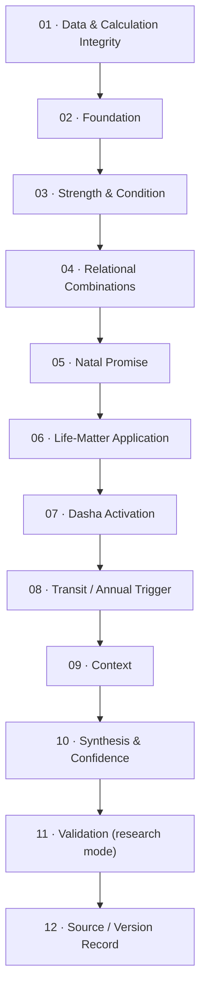

# Vedic reading layers — from reading framework to research framework

Research note capturing rammyps's own architecture for how a horoscope should be read (2026-09-18,
chat session), refined across two passes: a first "4 areas + Life Matters + one transit slice"
outline, then a detailed correction/expansion adding calculation integrity, an interpretive
hierarchy, event validation and explicit uncertainty. This is a **synthesis note**, not a book
extract — most of the individual techniques below already have their own cited source elsewhere
in this repo (linked per section); the *architecture* — a 12-stage pipeline with two cross-cutting
lenses — is rammyps's own restatement, on the `SRC_IKIASTRRO_SYNTHESIS` pattern already used for
[[life-matter-reference-pvr]] and [[argala-virodhargala-drishti-lifematters]]. No new `SRC_*` code
registered here. A parallel visual (Claude Artifact) exists at the URL rammyps has for this chat;
this file is the durable copy.

## Correction made while writing this

**"Systems' Approach" is V. K. Choudhry's term, not P.V.R. Narasimha Rao's.** An earlier draft of
the accompanying visual attached it to PVR by mistake. This repo already gets it right in
[[vedic-books]] ("V. K. Choudhry — *How to Study Divisional Charts* and Systems' Approach
material... a distinct methodology... implementation based on it should carry its own method and
source tags") — no repo file needed fixing, only the chat-side artifact did.

**PVR's own work is versioned, not fixed.** His research archive states that some calculations in
his older textbook — ayanāṁśa, divisional charts, annual charts, daśā selection — have since been
revised, matching what [[pvr-coverage]] already tracks under "PVR's own 2010 'Looking Back' note."
Jagannatha Hora exposes many of these as configurable settings rather than one default. That is
the whole motivation for Stage 01 below: no interpretation should run before the calculation
settings that produced it are declared and pinned — this project already practices this
(`pvr-coverage.md`'s per-chapter `Status`/divergence notes, ayanamsa hardcoded per the
`ikiastrro-ayanamsa-hardcode-decision` memory), but hadn't named it as its own layer before.

## The pipeline

Two things about this chain aren't purely sequential:

- **Stage 12 (source/version tag) applies to every stage**, including Stage 01 itself — a
  technique's citation and calculation-version belong wherever it's used, not only at the end.
- **Stage 06 (life-matter application) is also a lens**, not only a step: the significator matrix
  it builds is what Stages 02–08 already draw on once a specific question (career, marriage,
  health) narrows which house, planet and varga are relevant, rather than reading the whole chart
  generically.

## Stage 01 — Data &amp; Calculation Integrity (new)

Precedes interpretation entirely.

- **Birth-data provenance** — recorded vs. remembered time, hospital record, time-zone history,
  daylight-saving correction.
- **Location precision** — coordinates, historical place names, boundary/administrative changes.
- **Time conversion** — standard time, local mean time, historical calendar issues.
- **Sunrise definition &amp; day boundary** — the convention that fixes tithi/vāra assignment.
- **Ayanāṁśa declaration** — never mix Lahiri, Pushya-pakṣa, or another setting in one reading.
- **Node model** — mean vs. true Rāhu/Ketu, a fixed declared choice.
- **House model &amp; bhāva calculation** — whole-sign vs. another cusp system.
- **Divisional-chart calculation method** — more than one method exists per varga; the chosen one
  is a setting.
- **Ephemeris &amp; software version.**
- **Birth-time sensitivity** — which placements change at ±1/±2/±5/±10 minutes.
- **Rectification status** — unrectified / provisionally rectified / independently validated.

## Stage 02 — Foundation (extends v1's planets/houses/signs/vargas/nakṣatra)

- **Tithi, vāra, yoga, karaṇa** — the panchanga elements at birth (`pvr-coverage.md` Ch.1 already
  flags this as "not built").
- **Pakṣa &amp; lunar phase** as a qualitative fact (pakṣa *bala*, the strength score, is Stage 03).
- **Lagna degree, bhāva madhya, boundary proximity** — gated by Stage 01's sensitivity check.
- **Planetary avasthās** — Bālādi, Jāgradādi, Dīptādi, Lajjitādi, Śayanādi, per the chosen
  tradition. Cross-check against [[planetary-roles-avastha]].
- **Conjunction mechanics** — exact longitudinal separation, applying/separating, combustion
  thresholds, planetary-war rules, as precise mechanics rather than a yes/no flag.
- **Dispositorship chains** — rāśi dispositor → nakṣatra dispositor → final dispositor, plus
  mutual reception/parivartana as its own fact.
- **Functional benefic/malefic by ascendant** — moved here from the old "Relational" placement;
  it's a foundational fact about the planet in *this* chart, not a combination.
- **Maraka, bādhaka, dusthāna ownership.**
- **Natural vs. temporary (naisargika vs. tātkālika) relationships**, kept explicitly separate.
- **Rāśi and graha dṛṣṭi**, kept as two separate systems — already built, see
  [[argala-virodhargala-drishti-lifematters]].
- **Vargas as complete charts** — each gets its own lagna, house lords, kāraka, dispositor, yogas,
  and a confirmation check against D1. Rule of thumb: never interpret a divisional-chart placement
  without first checking (Stage 01) whether the birth time is accurate enough to support that varga.

## Stage 03 — Strength &amp; Condition

Split into three questions, since a planet can be powerful but harmful, or weak but benefic.

**Capacity:** bhavadhipati bala, ṣaḍbala (all six components), bhāva bala, viṁśopaka bala,
ashtakavarga (Sarva + Bhinna), iṣṭa/kaṣṭa phala, digbala, pakṣa bala, vargottama, vaiśeṣikāṁśa.
Ashtakavarga is [[pvr-coverage]] Ch.12, currently "not built" — the single largest strength gap.
Two extensions scoped in [[ashtakavarga-varga-extension]] once Ch.12 lands: applying the single
natal bindu table to every varga chart's placements (read-side, not a per-varga recompute — that
alternative is flagged unconfirmed pending a citation), and a new `AshtakavargaVargaCompareChart`
stacked-bar view (By House / By Sign, % bindu share per varga).

**Condition:** exaltation/debilitation distance from peak degree, nīcabhaṅga (and whether it
cancels, improves, or produces an actual rāja yoga), combustion/retrogression/planetary war as
condition modifiers, sandhi &amp; gandānta, affliction vs. support balance.

**Delivery** — a separate, explicit check that prevents "strong planet = good result": is the
planet strong enough to deliver at all; constructive or destructive; which houses does it own;
where does it deliver; in which daśā does it activate; does the relevant varga support the
promised result?

## Stage 04 — Relational Combinations

Between "what's strong" and "what it means" — entirely absent from the first pass. Parāśari and
Jaimini technique stay in separate modules; don't collapse them into one inferential step.

- **Yogas** — Rāja, Dhana, Ariṣṭa, Nabhasa and other named combinations. See [[pvr-coverage]] Ch.11
  (near-complete, ~96/98 named yogas + 59/59 numbered combinations already coded).
- **Parivartana, classified** — mahā / dainya / khala, three different qualities of the same
  exchange.
- **Sambandha types** — conjunction, mutual aspect, mutual reception, one-sided dispositorship.
- **Yoga viability tests** — exact rule match, participant strength, functional nature, affliction,
  relevant varga, daśā activation.
- **Yoga cancellation &amp; modification**, tracked as its own step.
- **Repeated themes over yoga-name counting.**
- **Argala strength** — primary/secondary, intervening-planet count, benefic/malefic character,
  virodhārgala cancellation, argala onto houses, lagnas, ārūḍhas *and* kārakas. Design sketch:
  [[argala-virodhargala-drishti-lifematters]]; still unbuilt per [[pvr-coverage]] Ch.10.
- **Ārūḍha ecosystem** — AL, Upapada, A2–A12, influencing planets, reality-vs-perception vs. the
  bhāva. [[pvr-coverage]] Ch.9: AL + 12 bhava arudhas built (`ArudhaCalculator`).
- **Jaimini module, kept separate** — chara kārakas, kārakāṁśa, svāṁśa, Jaimini's own rāśi dṛṣṭi
  and argala, chara daśā/other rāśi daśās. Record which system generated each conclusion; combine
  only at Stage 10.

## Stage 05 — Natal Promise (new)

Between combinations and timing. Before "when?", test whether the chart promises the event at
all — timing activates a promise, it doesn't manufacture one.

Test, per life matter: relevant D1 houses → house lords → natural and conditional kārakas → the
relevant divisional chart → the relevant ārūḍha (manifestation/appearance questions) → supporting
and obstructing yogas → repetition across independent indicators.

Classify: strongly promised · conditionally promised · mixed · weakly indicated · substantially
denied · **indeterminate because of birth-time uncertainty** (a legitimate output, not a failure).

## Stage 06 — Life-Matter Application

Both a lens (applied throughout) and a formal step (where a topic's significator set gets fixed
before timing). Replace a single house-to-varga lookup with a structured matrix per topic —
already partly modelled as `tbl_Rule_LifeMatterReference` (96 rows / 10 categories, see
[[life-matter-reference-pvr]]); this note's matrices are the same idea applied per-topic.

Worked example — career:

| Significator | Contribution |
|---|---|
| 10th house | Activity, authority, karma |
| 6th house | Employment, service, competition |
| 2nd house | Income, accumulated skills |
| 11th house | Gains, networks, fulfilment |
| Sun | Authority |
| Saturn | Labour, institutional responsibility |
| Mercury | Trade, analytical work |
| Amātyakāraka | Vocational agency (Jaimini) |
| D10 | Professional manifestation |
| Ārūḍha Lagna &amp; A10 | Visible professional position |
| Daśā + transit | Activation |

The same shape extends to relationships, children, health, education, property, wealth,
spirituality and foreign residence.

## Stage 07 — Dasha Activation (new)

The "what, and roughly when" half of timing — entirely missing from the first pass.

- **Multi-level periods** — mahādaśā, antardaśā, pratyantardaśā read together.
- **Period-lord condition** — natal role/condition (Stage 03), houses owned/occupied/aspected,
  nakṣatra lord and dispositors, divisional-chart position.
- **Relationships between period lords**, not each read in isolation.
- **Daśā-entry chart**, where used.
- **Conditional daśā eligibility** — a daśā-*selection* decision, not every system applied
  indiscriminately. PVR's newer research proposes a unified method for choosing among Vimśottarī
  and conditional nakṣatra daśās; that decision replaces a flat "Vimśottarī plus alternatives"
  list. Only Vimśottarī is built today ([[pvr-coverage]] Part 2 — ch.17–24 not built).

## Stage 08 — Transit / Annual Trigger

Runs in two passes rather than one flat check — v1 had one of five techniques here.

**Broad temporal confirmation:** transiting planet's nakṣatra vs. natal (v1's original slice) →
transit from Lagna, Moon, and the active daśā lord → transit to natal planets/sensitive degrees →
double-transit conditions → ashtakavarga support at the transited sign → Sade Sati/Panoti (Saturn
over 12th/1st/2nd from natal Moon) → the relevant annual chart (Tājika varṣaphala / solar return /
tithi praveśa per PVR's newer research) → progressed nakṣatra-daśā technique.

**Exact trigger:** transit conjunctions to natal points, nakṣatra/pada ingress, kakṣyā activation
(JHora's 8-fold per-sign subdivision), stationary/retrograde passes and repeated
direct–retrograde–direct contact, the lunar trigger, and a daily lagna/muhūrta-level check where
relevant. See [[pvr-coverage]] Part 3 and [`gochara-vedha-pvr.md`](gochara-vedha-pvr.md) (Table 63
transcribed, engine not built) — PVR's current research archive treats transit–daśā progression
and stationary-point conjunctions as their own branch, not generic gochara.

## Stage 09 — Context (new)

The same indication manifests differently depending on the life it lands in.

- **Individual context** — age/developmental stage, gender/cultural context, socioeconomic
  opportunity, geography/migration, education/profession, medical history, personal choices,
  family system.
- **Relational context** — concurrent events in related people's charts.
- **Deśa, kāla, pātra** — place, time, individual capacity — the classical three-factor frame.

## Stage 10 — Synthesis &amp; Confidence

Replaces "two techniques agree" (v1) with an explicit evidence record:

| Dimension | Question |
|---|---|
| Natal promise | Is the outcome structurally supported? |
| Repetition | Does it repeat across genuinely independent indicators? |
| Varga confirmation | Does the topic-specific chart agree? |
| Period activation | Do the operating daśās activate the same houses and kārakas? |
| Transit trigger | Is there a credible temporal trigger? |
| Birth-time stability | Does the finding survive plausible time error? |
| Contradictions | What factors oppose the conclusion? |
| Specificity | Was the statement made before seeing the outcome? |

Confidence levels, not scores: high / moderate / low / indeterminate — avoid numerical precision
unless the scoring model itself has been tested.

## Stage 11 — Validation (new, research mode)

The largest missing layer if "deeper" means more than more elaborate interpretation. Astrology has
no established scientific validation; this stage is what would be required before treating a
specific rule as more than traditional or exploratory.

Hypothesis before outcome (reproducible rule definition, stated before reviewing results) · data
quality ratings + discovery/validation chart split · negative cases and controls, not only fitting
examples · frozen settings (Stage 01) per study, rule variants recorded before testing · measured
false positives, blinded analysis, inter-rater agreement · full case list + exclusion criteria
published · distinguish textual support / internal coherence / retrospective fit / prospective
predictive performance as four different kinds of evidence.

## Stage 12 — Source / Version Record (new, cross-cutting)

Applies to every stage above, not only the last one.

**Source tag:** classical source + chapter/verse · commentator/lineage · PVR textbook · PVR class
notes · PVR research paper · Jagannatha Hora implementation · later practitioner addition ·
experimental rule.

**Version record:** exact Sanskrit term, translation, competing interpretations and the one
chosen · calculation version used, and whether PVR still endorses that version today. His freely
available textbook is the baseline system; his later research archive documents refinements —
treat them as different source strata, per [[pvr-coverage]]'s own "book is the canonical baseline,
not infallible" framing, not one silently merged authority.

## Suggested additions (not in rammyps's message — flagged for a decision, not built)

1. **Rule lifecycle, not just source.** Stage 12 records where a rule came from; nothing yet
   records how it changes over time. [[pvr-coverage]]'s own reconciliation log is already this
   discipline in practice for PVR's book — worth generalizing to the project's own derived rules
   too (e.g. when [[argala-virodhargala-drishti-lifematters]]'s open items get resolved one way,
   record it the way the log already does for yoga chapters).
2. **Cross-chart / synastry module.** Stage 09 names "concurrent events in related people's
   charts" but nothing computes it — kuta/guṇa matching, composite reading, multi-chart
   correlation deserve their own module, on the same separate-and-tag principle as the Jaimini
   module.
3. **Base-rate comparison in Validation.** Stage 11 measures false positives against a rule's own
   predictions; it should also compare the hit rate against how often the event happens with no
   astrological trigger at all, or a well-controlled hit rate can still look stronger than it is.
4. **Confidence surfaced to the end reader, not just the researcher.** Stage 10's confidence level
   and Stage 12's source stratum are easy to keep in research notes and lose by the time a reading
   reaches a user — worth an explicit decision on whether "traditional" vs. "exploratory" should
   ever reach the Web UI's interpretation text.
5. **The reverse query — muhūrta.** Every stage above answers "what does this configuration
   mean?" The same pipeline run in reverse — given a desired outcome, which future configuration
   would satisfy enough of the promise/timing/synthesis chain to be worth choosing — is a distinct,
   unaddressed query direction ([[pvr-coverage]] Part 5 Ch.36 Muhurta: not built).

## Open items before any of this becomes buildable

1. ~~None of Stages 01, 05, 09, 11, 12 have a `FEAT-*` slot~~ **Triaged 2026-09-22.** Stage 01
   → `ROADMAP.md` Later, "Data & Calculation Integrity surfacing" (new ground, no urgency
   signal yet). Stage 05 rides on `FEAT-HOUSE-05`'s significator matrix rather than needing its
   own engine feature. Stage 09 is mostly non-computable (age, culture, personal history) — a
   low-priority UI-input feature at best, not slotted. Stage 11 stays a research *discipline*
   (how the project validates rules), not a product feature — deliberately not given a
   `FEAT-*` row. Stage 12 is judged already satisfied by the project's existing `SRC_*`
   citation codes, `RuleSetId` versioning, and `pvr-coverage.md`'s own reconciliation log — no
   new slot needed, this note's contribution was naming the discipline, not creating a gap.
2. ~~Add a row to `v5-notes-index.md`~~ **Done 2026-09-22** — see that file.
3. The "suggested additions" above remain unconfirmed — parked as their own list in
   `ROADMAP.md` Later ("Reading-layers 'suggested additions'"), not promoted to `FEAT-*`
   candidates. Still needs rammyps.
4. Stage 03's Ashtakavarga item now has its own extension note,
   [[ashtakavarga-varga-extension]] (cross-varga bindu lookup + a By House/By Sign comparison
   chart) — triaged 2026-09-22 to `FEAT-ASHTAKAVARGA-02` (`ROADMAP.md` Now), now that
   `pvr-coverage.md` Ch.12 is corrected (Ashtakavarga shipped, wasn't actually blocking this).
   The cross-reference-vs-recompute citation question is still open — flagged in `masterproduct.md`.
